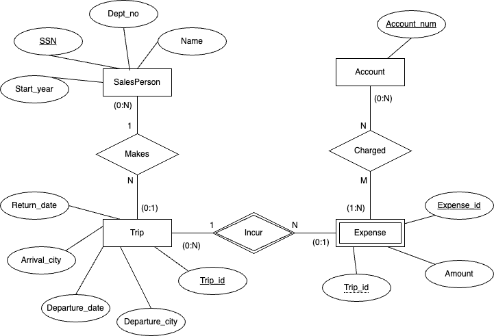

## **CSCI 327 – Sales Person's Trips**

---

**ER Diagram:**

**Assumptions:**

- Each trip is made by one salesperson.

- Each expense is associated with one trip.

- An expense can be charged to multiple accounts, and an account can have multiple expenses.

- The cities for departure and arrival are attributes of the Trip entity.