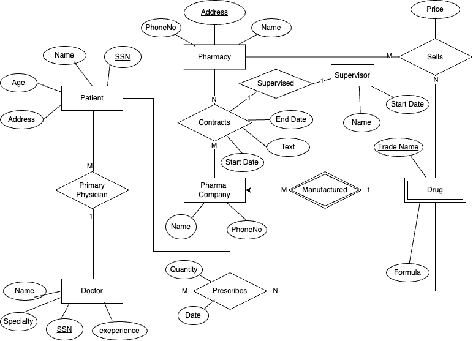
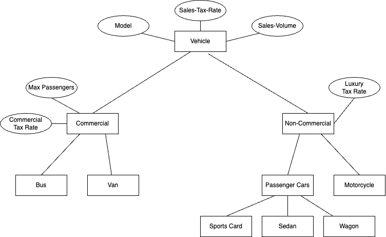

## **Homework 2**

---

### **Excercise 1**

#### Part 1:

**Constraints**

- Foreign key relationships must be enforced, such as ensuring that prescriptions only reference existing doctors, patients, and drugs.

- When a pharmaceutical company is deleted, its products (drugs) should also be deleted.

- If the same doctor prescribes the same drug for the same patient multiple times, only the last prescription is stored. We need a a prescription attribute to store the date of the prescriptions so we can keep track of the last one.

#### Part 2:

Then we can assign Price as an attribute to the drug entity, optionally we can also add a primary key to the prescription entity.

#### Part 3:

We can make a new entity called "prescription", and connect it to Perscribes Relationship, and add a primary key to the prescription entity called "id" which will then help track them easily also each one can be unique.

### **Excercise 2**

#### Part 1:

#### Part 2:

- Vehicle level: Model, Sales-Tax-Rate, and Sales-Volume apply to all vehicle types, so they belong at the top.
- Commercial Vehicle level: Max Passengers Allowed and Commercial Vehicle Tax Rate only apply to buses and vans, so they are placed here.
- Non-Commercial Vehicle level: Luxury Vehicle Tax Rate applies to some non-commercial vehicles, so it is placed here instead of at the Vehicle level.
- Passenger Car level: Different types of cars (Sedan, Sports Car, Wagon) need specialization but don’t require additional attributes at this level.

