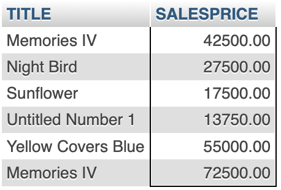
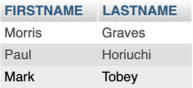
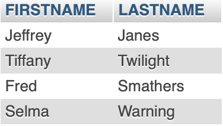
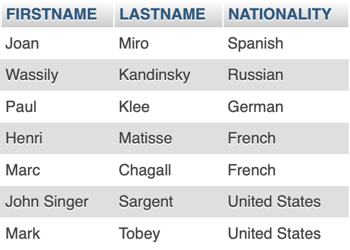

## **Homework 4**

---

### **Part A**

```SQL
SELECT TITLE, SALESPRICE 
FROM WORK 
NATURAL JOIN TRANS 
WHERE SALESPRICE > 10000;
```




### **Part B**

```SQL
SELECT DISTINCT FIRSTNAME, LASTNAME
FROM ARTIST
NATURAL JOIN (WORK NATURAL JOIN TRANS)
WHERE SALESPRICE > 10000;
```




### **Part C**

```SQL
SELECT DISTINCT FIRSTNAME, LASTNAME
FROM CUSTOMER
NATURAL JOIN TRANS
WHERE SALESPRICE > 10000;
```




### **Part D**

```SQL
SELECT FIRSTNAME, LASTNAME, NATIONALITY
FROM ARTIST
WHERE DATEOFBIRTH BETWEEN 1850 AND 1900;
```




### **Part E**

```SQL
SELECT DISTINCT TITLE
FROM ARTIST
NATURAL JOIN WORK
WHERE NATIONALITY LIKE 'F%'
UNION (
    SELECT DISTINCT TITLE
    FROM CUSTOMER
    NATURAL JOIN WORK
    WHERE COUNTRY LIKE 'F%'
);
```

