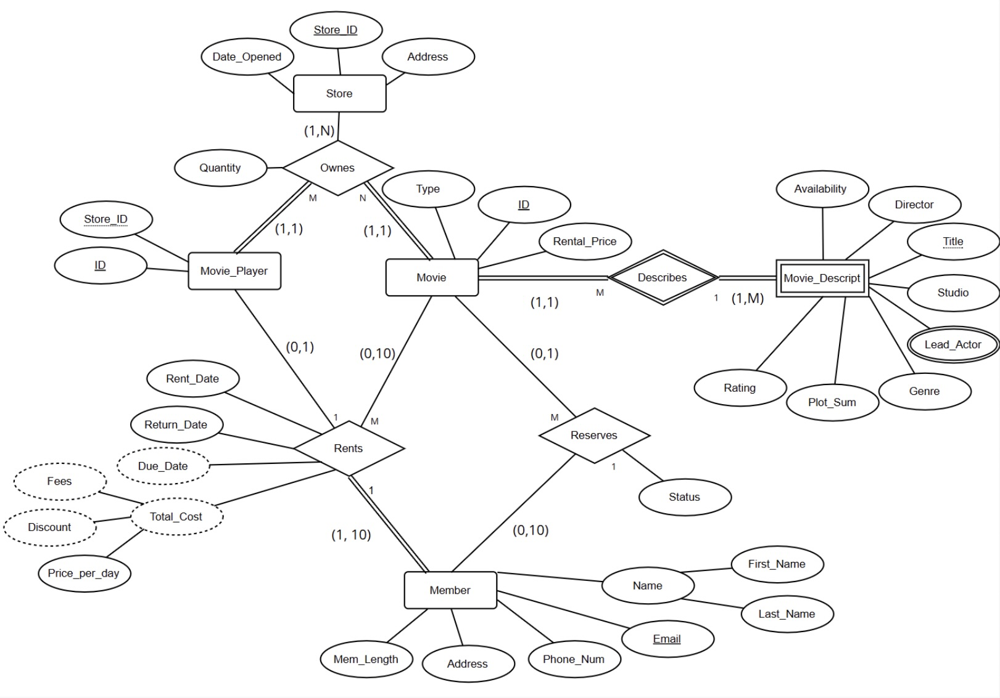
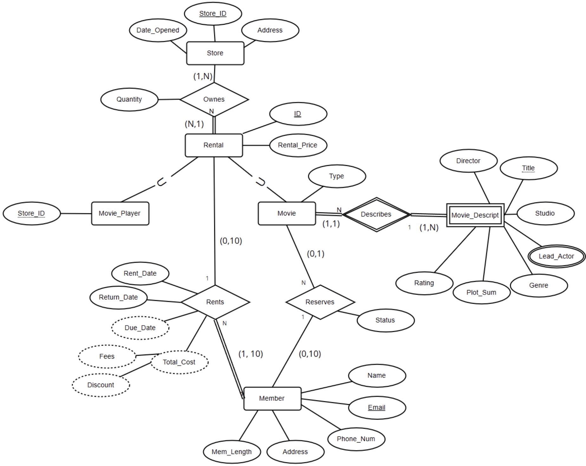

## CSCI 327 – Project: Deliverable 1

---

### **Group Members**

Our team consists of *two* students: 

- [**Sepehr Akbari**](https://moodle.lakeforest.edu/user/view.php?id=24222&course=14240)

- [**Ilana Berlin**](https://moodle.lakeforest.edu/user/view.php?id=24262&course=14240)

### **ER Diagram**

This is the Entity Relationship Diagram (ER) representing our vision of the Video Store System, following all the requirements and constraints given in the project description, plus some additional features we thought would be useful.

We have also included the Enhanced Entity Relationship Diagram (EER):

### **Assumptions**

1. *Assumptions based on description:*

    - A member can rent up to 10 movies (BDs/DVDs) and 1 player at a time.

    - A rented movie can be returned to any store, but a rented player must be returned to the same store it was borrowed from.

    - VideoStore carries multiple copies of the same title.

    - A store can be assigned any number of copies.

    - Extra copies beyond the assigned amount are returned to the head office and redistributed.

    - A 10% discount is awarded on weekday rentals for all items.

    - The online catalog lists the title, studio, director, two lead actors, genre, number of BDs/DVDs, and daily charge.

    - Members can reserve movie titles online, and the store charges items per day.

2. *Additional assumptions:*

    - A weak entity called “Movie_Description,” was created, which stores attributes like rating and plot summary to make the online catalog more detailed.

    - Extra attributes such as Phone_Num, Address, and Mem_Length were added to the “Member” entity to help with sending reminders, ads, and loyalty promotions.

    - A primary key of “Movie_Player” includes a Store_ID (as a composite key) to ensure each player can be traced back to its home store.

    - Modeled the “Type” of movie (DVD or Blu-ray) as an attribute (potentially Boolean) rather than creating separate subclasses.

    - Total cost is derived by the difference between Return_Date and Rent_Date, plus any fees for late returns or discounts for weekdays.

    - Added a Status attribute in “Reserves” to indicate if a reserved movie is ready for pickup.
