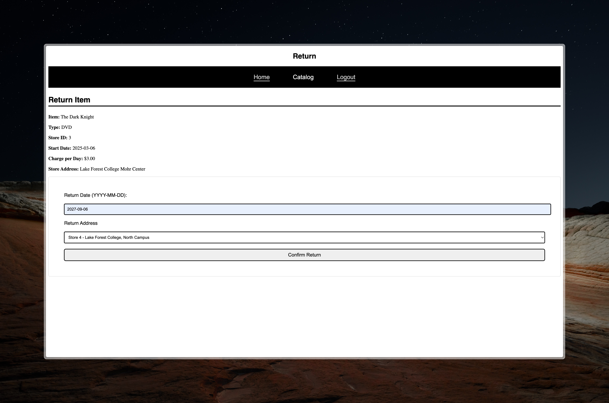

## CSCI 327 – Project: Deliverable 3

---

### Table of Contents

1. [Group Members](#group-members)

2. [Features](#features)

3. [Screen Shots](#screen-shots)

4. [Difficulties](#difficulties)

5. [Usage](#usage)

### **Group Members**

Our team consists of *two* students:

- [**Sepehr Akbari**](https://moodle.lakeforest.edu/user/view.php?id=24222&course=14240)

- [**Ilana Berlin**](https://moodle.lakeforest.edu/user/view.php?id=24262&course=14240)

### **Features**

1. Landing Page:

    - Login

        - Automatically redirects admin credentials to the admin page
        - Automatically redirects user credentials to the user page
        - Checks for valid credentials, and displays an error message if invalid

    - Sign Up

        - Allows new users to create an account
        - Validates the input fields (name, password, password-confirmation, email, and phone number)
        - Displays an error message if any field is invalid, or non-optional fields are empty
        - Redirects to the login page after successful sign-up
        - Displays a success message after successful sign-up

2. Member's dashboard:

    - Displays a welcome message with the user's name
    - Allows users to search for movies by id, title, genre, producer, director, and actors.
    - Allows users to search for players by id, and generation (1-3).
    - Allows users to rent and reserve movies.
    - Allows users to rent players.
    - Allows users to specify the type (DVD or Blu-ray) of the movie they want to rent, shows charge per day, rental period, and movie's rating.
    - Allows users to specify the type (DVD or Blu-ray) of the player they want to rent, shows charge per day, rental period, player's generation, and the store they have to return the player to.
    - Rentals placed on weekdays get a 10% discount, with the user being notified of the discount.
    - Allows users to view their rented and reserved movies.
    - Allows users to view their rented players.
    - Allows users to delete or rent their reserved movies.
    - Allows users to return their rented movies.
    - Allows users to return their rented players to the rented store.

3. Admin's dashboard:

    - Displays a welcome message with the admin's name
    - Allows admins to add new movies and players.
    - Allows admins to update existing movies and players.
    - Allows admins to delete movies and players.
    - Allows admins to view all movies and players.
    - Allows admins to view all users and admins.
    - Allows admins to view all rentals and reservations.
    - Allows admins to view all stores.
    - Allows admins to switch to a Member's View so they can also rent and reserve movies and players.
    - The admin's dashboard displays repots of: 
        - Total revenue by stores
        - Total revenue by movies
        - Total revenue by player generation
        - Top 10 movies rented
        - Top 10 active members

4. Policies:

    - The user cannot return a player to a different store than the one they rented it from.
    - The user cannot return a movie or player at a checkout time in the past.
    - The user cannot rent more than 1 player at a time.
    - Items cannot be deleted if they are currently rented or reserved.
    - A member cannot be deleted by the admin if they have active rentals or reservations.
    - All the unique attributes such as email, required fields such as description in movies, etc. are validated using either SQL in the database schema or PHP in the code.

### **Screen Shots**

Signup Page:

Login Page:

Member's Dashboard:

Admin's Management:

Member's Dashboard:

Member searching:

Member Returning Item:

Example Messages:

### **Difficulties**

1. Database Design:

    - Making sure foreign keys were not duplicated or interfering with each other.
    - We also realized that checking for some of the requirements especially when it came to dates in the SQL is simpler than in PHP.
    - Excitedly, we tried normalizing the database when we learned about it, but it was too late for us...

2. Functionalities (PHP):

    - Counting the current date as the present date and not in the past.
    - Validating that unique keys were not duplicated without causing an SQL error.
    - Having the reserved items be checkout normally.
    - Making sure the user could not return a player to a different store than the one they rented it from.
    - Making sure the user could not return a movie or player at a checkout time in the past.
    - Making sure the user could not rent more than 1 player at a time.
    - Having items count reduced from items table when rented.
    - Getting the reports to show up exactly correct. Our database design was not the most simple, and writing correct SQL queries was a bit tricky.

3. User Interface (HTML/CSS):

    - Adding a User View to the admin's dashboard.
    - Making editing a movie or player smoother without redirecting to a new page.

### **Usage**

The project is available on GitHub with instructions on how to run it.

[GitHub Repository](https://github.com/SepehrAkbari/videostore)